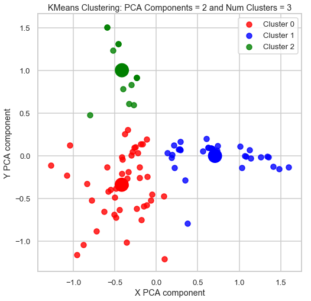

# Wine-Customers-Segmentation

In this project, we perform Customer Segmentation of Wine Customers using several clustering modeling techniques (K-Means, Affinity Propagation, Spectral Clustering, Agglomerative Clustering, DBSCAN). The dataset contains both information on marketing newsletters/e-mail campaigns (e-mail offers sent) and transaction level data from customers (which offer customers responded to and what they bought). 

Using PCA (Principal Component Analysis) to visualize clusters, we can see below the 3 clusters that are segmented by the K-Means model. 

The 3 clusters show the following traits
* Cluster 0 Customers:
	* All the Cabernet Sauvignon and Chardonnayo purchases were made by these customer
	* These customers purchase wines in larger quantities

* Cluster 1 Customers:
	* All the Pinot Grigio purchases were made by these customer
	* They tend to purchase wines if offers are made for lower minimum quantity requirements.

* Cluster 2 Customers:
	* They are primarily from Australia and Europe
	* Though most sales are reported during the months of March, December and August these customers do not purchase wine during those 3 months
	* They prefer Red wine, and Pinot Noir in particular.
	* They do NOT purchase any wine that is past its peak.

